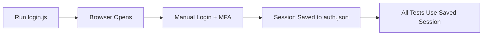

# RAG Test Automation

AI-powered Playwright test generator using RAG (Retrieval Augmented Generation) for automated travel booking system testing.

## 🎯 Overview

This project automatically generates robust Playwright test scripts from Excel test cases using a RAG-based approach. It includes authentication handling, knowledge base management, and dynamic test generation.

## 📋 Complete Workflow

### **Step 0: Authentication Setup (One-time or when session expires)**

```bash
node login.js
```

**What happens:**
- Opens browser window (non-headless)
- Navigates to login page
- Waits 60 seconds for you to manually complete login + MFA
- Saves authenticated session to `auth.json`
- All subsequent tests will reuse this session

---

### **Step 1: Generate Feature Files from Excel**

```bash
node generateFeatures.js
```

**What happens:**
- Reads `jira_input.xlsx`
- Generates Gherkin `.feature` files in `tests/features/`
- Creates feature files for each test case

---

### **Step 2: Generate Retrieve Booking Test**

```bash
npm run gen retrieve_bookings
```

**What happens:**
- Reads `rag/flows/retrieve_bookings.json`
- Loads knowledge bases: `selling-app.json`, `finance-accounting.json`
- Generates `tests/playwright-specs/retrieve_booking.spec.js`
- Includes visibility checks, hasText filters, and proper waits

---

### **Step 3: Run Retrieve Booking Test**

```bash
npx playwright test retrieve_booking.spec.js
```

**What happens:**
- Executes test with saved authentication
- Navigates to Selling App
- Retrieves booking by ID
- Captures Total Amount Paid

---

### **Step 4: Generate Verify Amounts Test**

```bash
npm run gen verify_amounts
```

**What happens:**
- Reads `rag/flows/verify_amounts.json`
- Generates `tests/playwright-specs/verify_amounts.spec.js`
- Creates end-to-end test comparing Selling App vs Accounting amounts

---

### **Step 5: Run Full Test Suite**

```bash
npx playwright test
```

**What happens:**
- Runs all tests in `tests/playwright-specs/`
- Uses saved authentication from `auth.json`
- Generates HTML report in `playwright-report/`

---

## 🏗️ Project Structure

```
/workspace
├── login.js                          # Authentication handler
├── auth.json                         # Saved session (generated)
├── generateFeatures.js               # Excel to Gherkin converter
├── jira_input.xlsx                   # Input test cases
├── package.json                      # Dependencies
├── playwright.config.js              # Playwright configuration
│
├── rag/
│   ├── rag-cli.js                    # Main CLI for test generation
│   ├── engine/
│   │   ├── actions.js                # Action templates (click, fill, etc.)
│   │   ├── generator.js              # Test code generator
│   │   └── retriever.js              # Flow and KB retriever
│   ├── flows/
│   │   ├── retrieve_bookings.json    # Retrieve booking flow
│   │   └── verify_amounts.json       # Amount verification flow
│   └── kb/
│       ├── selling-app.json          # Selling App selectors
│       └── finance-accounting.json   # Accounting selectors
│
└── tests/
    ├── features/                     # Generated Gherkin files
    └── playwright-specs/             # Generated Playwright tests
        ├── retrieve_booking.spec.js
        └── verify_amounts.spec.js
```

---

## 🎨 Generated Test Features

All generated tests include:

✅ **Visibility Checks** - `expect(element).toBeVisible({ timeout: 10000 })`  
✅ **hasText Filters** - `page.locator('selector', { hasText: 'text' })`  
✅ **Variable Declarations** - Named variables for better readability  
✅ **Step Comments** - Clear step-by-step documentation  
✅ **Smart Waits** - 1000ms for UI, 2000ms for accounting module  
✅ **100 Second Timeout** - Sufficient for slow page loads  

---

## 🔧 Configuration Files

### **Knowledge Base (`rag/kb/*.json`)**
Maps logical names to CSS selectors:
```json
{
  "RetrieveBookingsTab": {
    "selector": "a.mt_ret",
    "text": "Retrieve Bookings",
    "description": "Retrieve Bookings tab in Selling App"
  }
}
```

### **Flow Files (`rag/flows/*.json`)**
Define test steps and actions:
```json
{
  "name": "Retrieve booking and capture Total Amount Paid",
  "intent": "retrieve_booking",
  "inputs": { "bookingId": "G22232" },
  "steps": [
    { "action": "goto", "url": "...", "description": "Navigate to..." },
    { "action": "click", "module": "selling-app", "locator": "RetrieveBookingsTab" }
  ]
}
```

---

## 📦 Dependencies

```json
{
  "@playwright/test": "^1.43.0",
  "xlsx": "For Excel parsing"
}
```

---

## 🚀 Quick Start

```bash
# 1. Install dependencies
npm install

# 2. Authenticate (one-time)
node login.js
# Complete login + MFA in browser window

# 3. Generate tests from Excel
node generateFeatures.js

# 4. Generate Playwright specs
npm run gen retrieve_bookings
npm run gen verify_amounts

# 5. Run tests
npx playwright test

# 6. View report
npx playwright show-report
```

---

## 🔑 Authentication Flow



The `auth.json` file contains:
- Cookies (session tokens, authentication cookies)
- Local storage (user preferences)
- Session storage (temporary data)

**Note:** Re-run `node login.js` when:
- Session expires
- Tests fail with authentication errors
- Switching between environments

---

## 📝 Adding New Tests

1. **Define flow** in `rag/flows/your_test.json`
2. **Add selectors** to appropriate KB file
3. **Generate test**: `npm run gen your_test`
4. **Run test**: `npx playwright test your_test.spec.js`

---

## 🐛 Troubleshooting

| Issue | Solution |
|-------|----------|
| Authentication errors | Run `node login.js` to refresh session |
| Element not found | Update selectors in `rag/kb/*.json` |
| Test timeout | Increase wait times in flow configuration |
| Excel parsing fails | Check Excel format matches expected structure |

---

## 📊 Test Execution Flow

```
1. Read auth.json (session)
2. Load Playwright config
3. Launch browser with authentication
4. Execute test steps:
   - Navigate to pages
   - Wait for elements to be visible
   - Perform actions (click, fill, etc.)
   - Capture data
   - Assert expectations
5. Generate HTML report
```

---

## 🎯 Best Practices

- Always run `node login.js` before starting test development
- Keep knowledge base selectors up to date
- Use descriptive step descriptions in flow files
- Test individual specs before running full suite
- Review HTML report after each run

---

## 📄 License

See LICENSE file for details.